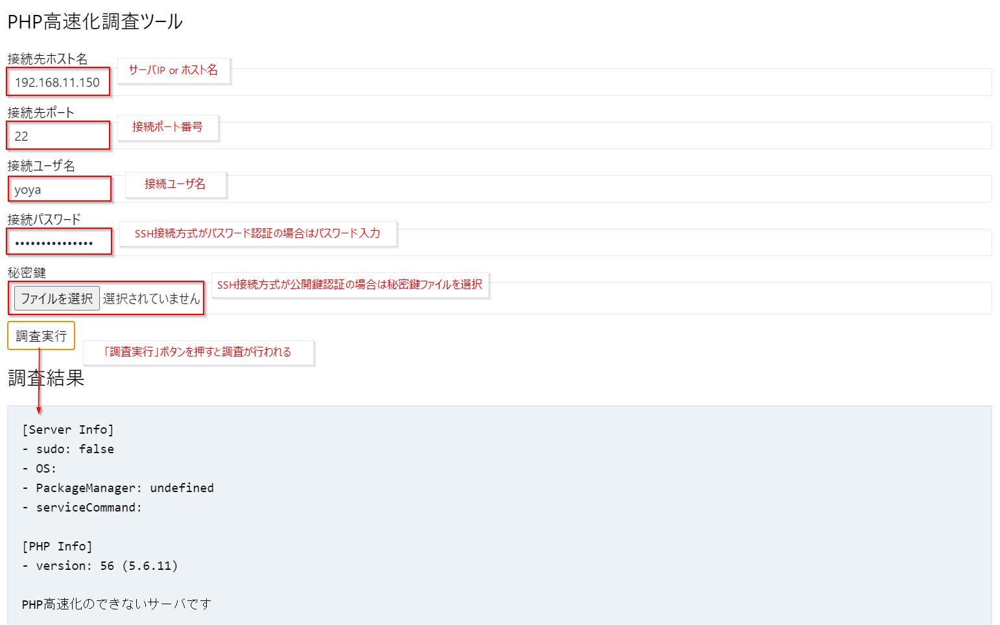

# PHP高速化くん｜マニュアル

## 調査マニュアル

### SSH接続情報を聞き取り
SSH接続のために以下の情報を聞き取りする

- SSH接続先ホスト名（IP）: 必須
    - SSH接続用のサーバIP、もしくはホスト名
- SSH接続ポート番号: 必須
    - デフォルトは `22` のため、もし聞き取りして分からなければ、とりあえず `22` で試す
- SSH接続ユーザ名: 必須
    - SSH接続可能なユーザ名
- SSH接続パスワード: 任意
    - SSH接続用のパスワード
    - 公開鍵認証の場合、パスワード接続を許可していないサーバが多いため、この情報はないことも多い
- SSH接続秘密鍵: 公開鍵認証の場合必須
    - 公開鍵認証の場合、秘密鍵ファイルがないとSSH接続できない
    - ファイルサーバ等に置いてあると上手く読み込めない時があるため、ローカルにダウンロードしておく
        - ※ セキュリティ上の懸念から、調査完了後は秘密鍵ファイルをローカルから削除しておくこと

SSH接続情報が分からない、SSH接続できない、という場合はPHP高速化の対象外である

### PHP高速化調査ツールの準備
[php-acceralation-1.0.0-win.zip](./dist/php-acceralation-1.0.0-win.zip) を解凍して使用する

※ 現在、Windows 64bit 版のみ提供しているため、他のプラットフォーム用のアプリケーションが必要な場合は、開発者に依頼すること

解凍後、`php-acceralation.exe` を起動する

### 調査実行
SSH接続情報をアプリケーションに入力して「調査実行」ボタンを押す

#### 調査結果の見方
- `PHP高速化のできないサーバです` になった場合
    - 高速化対象外のため諦める
- `PHP高速化可能なサーバです` になった場合
    - `o OPcache インストールによる高速化が可能です` の場合
        - OPcache を導入することにより高速化できる可能性あり
    - `o APCu インストールによる高速化が可能です` の場合
        - APCu を導入することにより高速化できる可能性あり
    - `× OPcache はインストール済みです` + `× APCu はインストール済みです` の場合
        - 既に高速化対策済みのため、これ以上のPHP高速化は難しいかもしれない
